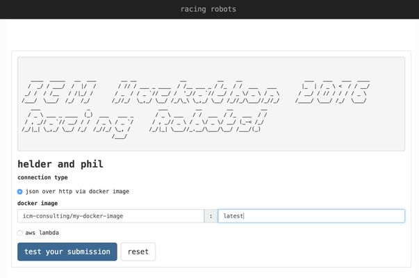
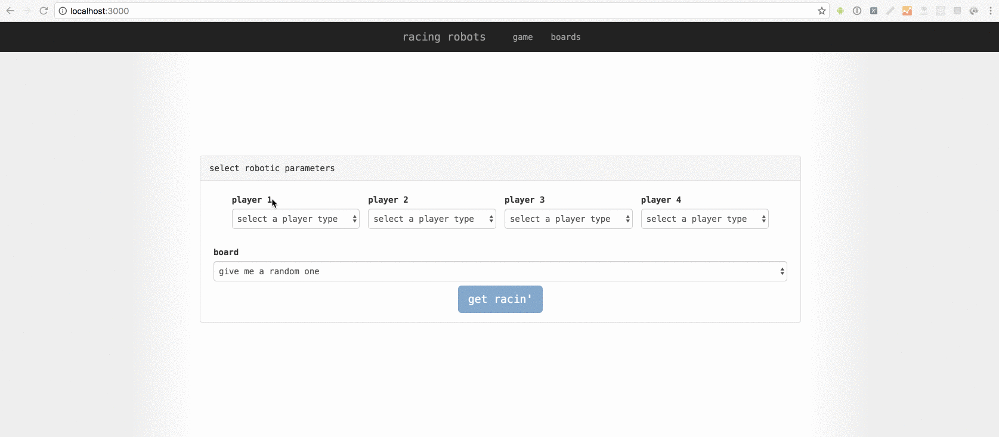
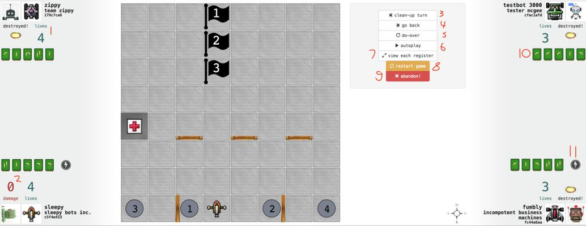
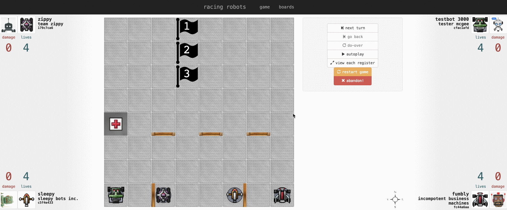
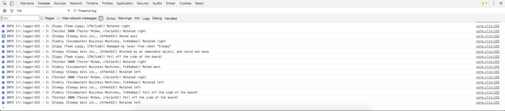
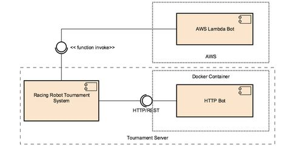
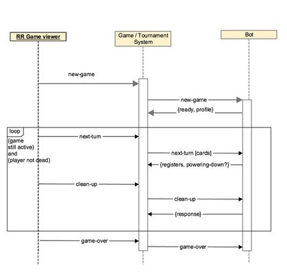
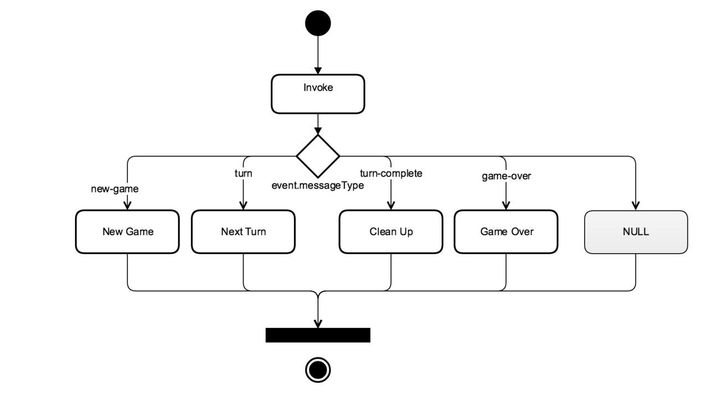

# Racing Robots Programming Challenge (Hackathon) 

```  
   ___               _                      ___         __        __         __                                
  / _ \ ___ _ ____  (_)  ___   ___ _       / _ \ ___   / /  ___  / /_  ___  / /                                
 / , _// _ `// __/ / /  / _ \ / _ `/      / , _// _ \ / _ \/ _ \/ __/ (_-< /_/                                 
/_/|_| \_,_/ \__/ /_/  /_//_/ \_, /      /_/|_| \___//_.__/\___/\__/ /___/(_)                                  
                             /___/
```                             
                             
Racing Robots is an four player game, based on the board game [Robo Rally](https://boardgamegeek.com/boardgame/18/roborally), the goal being to be the first robot to touch all flags on the board in order.

A competitor in the programming challenge, you will take control of one of the racing robots, and using randomly drawn program "cards", guide your 'bot around walls, rotators, conveyer belts, lasers, and other player's robots, in order to be the first to reach all flags - or just to be the last robot standing.

## Running your own Hackathon/Programming Challenge using this repo
There are a few steps you will need to follow if you want to host your own event using this repo

### Building the Test Harness

Prerequisite: You will need the [Leiningen](http://leiningen.org/) build tool.

Then, to build the jar file:

`$ lein do clean, test, uberjar`

The same jar file is used for both the test harness and the tournament server - the web pages that are accessible are driven by the env:

`$ java -jar rr-test-harness-1.0.12.jar` << Starts in test harness mode
`$ MODE=tournament java -jar rr-test-harness-1.0.12.jar` << Starts in tournament mode

### Running on AWS

TODO

## Competitor's Instructions
### Overview
"Racing Robots" is a modified/simplified version of the board game "Robo Rally". The bulk of the rules of Racing Robots are the same as Robo Rally; the Robo Rally rules are attached below. You will need to refer to the Robo Rally rulebook in order to understand the basic game mechanics.

[The Robo Rally rules can be found here](http://media.wizards.com/2015/rules/robo_rally_rules.pdf)
-----Read the Robo Rally instructions now before continuing-----

 Racing Robots has a few notable differences to Robo Rally, outlined in the next section.
 
### Differences between Racing Robots and Robo Rally
* Racing Robots does not have the concept of "Option Cards" at all, so any mention of these in the rulebook can be ignored.
* Racing Robots does not have any "Pusher" squares on any boards that you will play on, so these can be ignored.
* Respawning:
** When your robot respawns after being destroyed, you will not get a choice of the direction your robot faces - this is randomly selected for you.
** The order in which robots are respawned is determined by the order number of the player (this is randomly determined at the start of the game, and is indicated by the docking number your robot starts on).
** If a conflict occurs when placing your robot on the docking bay or archive marker during a respawn (if another robot currently occupies your archive marker square or docking bay), you will not get a choice of square in which your robot is placed - this is randomly selected for you.
** Upon being destroyed, a robot is immediately removed from the board, and cannot obtain anymore damage during that turn.
* Powering Down:
** Selecting to power down is done at the same time as registers are selected - that is, at the same time as all other players. That means this is done without knowledge of whether other players will be powering down in subsequent turns.
** If a robot is powered down during a turn, the player can only select to continue the power down during the clean-up phase.
** Each time your robot powers down, it has a small undisclosed chance of *catastrophic failure* - the actual effect of the failure is unknown, but could be anything from loss of life, to a random position transportation. You should consider powering down only as a last resort.
* Turn Mechanics:
** Your AI player has 10s to respond to each request. If a response is not received in 10s, your robot will receive 5 damage points and will not partake in the current turn/clean up phase.
** If an invalid response is received, including invalid register selection or a response that doesn't conform to the standard required, then 5 damage points will be applied to your robot. Note, invalid responses can result in unspecifiedunpredictable behaviour.
** A draw can occur if the last robots on the board are destroyed in the same turn and register, AND both robots have touched the same number of flags. In the event of a draw, points will be used to determine the winner; the score is calculated by:

` score(robot) = (number_of_flags * 100) + (lives_remaining * 25) + number_of_turns - num_times_powered_down`

### Submission Requirements 

You are required to submit your AI bot using one of two methods.

1. A Docker image that hosts a HTTP server, pushed to a specified image registry, or
2. An AWS Lambda function**

For details on the format of both Lambda and Docker submissions, see the Racing Robot Integration Guide section below.

#### Names and Avatar

You must decide on:
1. A team name (e.g. Team Awesome)
2. A name for your robot (e.g. Awesomebot 9000)

An avatar image that will appear in your player sheet in the game screen. The Avatar will look best if it is a square image. 

### Submitting your Submission
You will be given a link to a page where you can enter your submission details. The page will looks similar to the image below. 



After entering the specifics of your docker image or lambda function, the details you entered will be tested before they will be saved.

* For Docker images, the image will be pulled and a container will be started. A connection will be attempted to the required HTTP port.
* For AWS Lambda functions, the function will be checked to see if it exists, and a NULL* request will be sent to ensure authorisation is set up correctly.
* For both submission types, a New Game will be attempted and team profile will be retrieved.

If either of the above tests fail, then the submission will not be accepted and you will be asked to fix it.

Tech Bonus (**)
Any team that uses AWS Lambda for their AI bot will start each game with 2 less damage points than any player not using Lambda. Additionally, each time an Lambda bot is destroyed, it is respawned with 2 less damage points.
That means that a bot controlled by an Lambda function will start the game with "-2" damage points, and will respawn with "0" damage points (other players will start the game with 0 and respawn with 2).

### Tools and Examples
#### Test Harness
You will be provided with a test harness which will allow you to test and refine your AI bot by simulating games as they will be played during the tournament, and to view the boards that your bot could be competing on during the tournament.

##### Starting the test harness
The test harness runs as a HTTP server from a compiled jar file. Start it using:

`$ java -jar rr-test-harness-1.0.12.jar`

In your browser (Chrome only, please), visit [http://localhost:3000]

##### Note for testing Docker containers
To test your docker container using the test harness, you will need to ensure the following environment vars are set:
`DOCKER_HOST`
`DOCKER_CERT_PATH`
`DOCKER_MACHINE_NAME`

If using docker-machine (if you're on a mac or windows, you may be), these can be obtained by running:

`$ docker-machine env`

Otherwise, check the Docker documentation to determine how you would find this.

To ensure these env vars are accessible in the test harness, start the harness by:

`$ DOCKER_HOST=tcp://192.168.99.100:2376 DOCKER_CERT_PATH=/Users/me/.docker/machine/machines/default DOCKER_MACHINE_NAME=default java -jar rr-test-harness-[VERSION].jar`

##### Starting a simulated game
To start a game simulation using your AI bot (or with just example "CPU player" bots), follow the screencast below.



[Starting a new game simulation]

Note: A HTTP/REST bot connector is provided to help speed up feedback in early testing for teams that intend on submitting their bot using docker (so a new docker image doesn't have to be built for every minor change). However, this connector type is unavailable for use in your final submission.

Four different example bots are provided for you to play against in the simulator. However, these bots are not very good at playing the game. As a rule of thumb, you should be able to consistently beat any of them if you have any chance of winning the tournament!

##### Anatomy of the Game Simulator
Game simulations in the test harness can either be progressed step-by-step, or using the autoplay feature.
When progressing step-by-step, you will have a chance to retry a turn or go back a step, which will enable you to make tweaks as you go when you see problems occur.



Each player in the game is represented in a different corner of the screen.
1. The amount of lives left for the player. When a robot is destroyed for a player with 0 lives left, the player's game is over.
2. The amount of damage points accumulated by the robot for the current life.
3. Progress the game by a single tick - a tick is either the Turn/Register phase, or the Clean-up phase (displayed).
4. Go Back a tick. If the previous tick was a Clean Up phase then this resets the game back to after the previous turn. If the previous tick was a Turn/Register phase, then this resets the game back to after the previous Clean Up phase.
5. Do-over the previous turn. This reruns the previous tick, using exactly the same turn (i.e. the same dealt cards) - useful for refining an algorithm. Note: this is different from (4), which does not rerun the same tick again.
6. Autoplays the game. While autorunning, this button changes to a "pause" button.
7. By default, the game simulator will only display the board state after ALL of the registers have been executed. Toggle this button to view the result of each register in sequence.
8. Abandon and restart the same game - i.e. with the same bots and board selected.
9. Abandon the game completely and return to the New Game screen.
10. The list of registers selected by the player for the previous turn. Locked registers appear grey.
11. The player will be powering down next turn.

The following screengrab depicts an example use of the game simulator.



You can view an event log for each robot in the game via the browser developer console.



### General Rules for Participants
This being a Hackathon, the rules for how your implement your solution are kept very light - as long as you meet the Submission Requirements, then almost everything else is on the table, within the following guidelines:

* A player must not interfere with the execution of the Tournament software, or any other player's bot system (including the software and/or resources). Doing so will disqualify the player and their team from the competition.
* It is the player's responsibility to ensure that their bot is operational whilst the tournament is being played. If a player's bot becomes unresponsive during the tournament due to a software error, then the tournament will not be stopped in order for the player to make corrections (particularly if Docker is used for submission). If an error occurs that affects multiple players, then the current match may have to be restarted in order to fix the issue.

### Integration Guide
Your Racin' Robot bots will communicate with the tournament (and test harness) systems via JSON messages, with your bot system acting as a "server" that will accept messages and respond with instructions that will drive your bot through the game.

#### Bot Communication
The Racing Robot tournament system communicates with all bot types using JSON messages, using either AWS Lambda or HTTP/REST services.



Each bot server communicates with a bot using 4 different messages - each Racing Robot bot will need to implement handlers for each of these messages in order to participate in a game that will provide a response. The sequence diagram below outlines how these messages are sent during the course of a single game.



##### Messages
###### New Game
The new game message is sent to bots at the commencement of a new game, and when registering your bot submission.

The data in the request message includes:
* The Game ID code
* Your bot's Player ID code (for the current game - this will change from game to game)
* The board which the game will be played on
* Current metrics and attributes for your bot (lives remaining, position, direction facing etc.)
* The other players in the game, and their bot metrics and attributes

Your bot's response will need to include:
* A response to indicate that the bot is ready for the game
* Your bot's profile (your team name, robot name and avatar image)

###### Next Turn
The next turn message is passed to each bot for each turn in a game. 

The data in the next turn message includes:
* All of the attributes provided in the New Game message, updated to the current game state
* The register cards drawn for the bot for this turn
* The number of register cards that the bot is expected to play in its response

The bot's response will need to include:
* The list of register cards (from the drawn cards), in the order in which they will be executed
* Whether the bot will be powering down in the subsequent turn

###### Clean Up
The clean up message is passed to each bot after all registers have been executed for each turn in the game. The purpose of the clean up message is to:
* For bots that are powering down in the next turn, and that have been destroyed in the current turn, give these bots the opportunity to override the previous power down command
* For bots that were powered down during the current turn, to continue powering down in the next turn.

The data in the clean up message includes:
* All of the attributes provided in the New Game message, updated to the state of the game after the registers of this turn have been executed.
* The registers played by the other players in the game
* The set of available responses for your bot to make

The bot's response  will need to include:
* One of the available responses in the clean up message.

###### Game Over
The game over message is passed to each bot at the completion of a game. Your bot does not need to provide a response to this message in order for it to function correctly - it's merely here for bots that wish to collect data on games they have participated in.

The data in the game over message includes:
* The list of winners
* The players and their scores for the game (note - scores are only used to determine an absolute winner in the event of a tie)

A response can be provided by the bot, but is ignored.

#### HTTP / REST Interface
The HTTP/REST interface that a Docker (and a test HTTP bot in the test harness) bot must provide, is specified via the following Swagger API spec file.

[Swagger spec](docs/swagger.yaml)

##### Did you know?
You can take a swagger definition file, and generate skeleton servers, for a variety of different languages and frameworks.
Checkout [http://swagger.io/swagger-codegen/]() for more information on how to do this, to help you get up and running faster. 
Note, however, swagger-codegen isn't perfect, and depending on the language you use you may find that there are a couple of fields missing - indeed, there is an outstanding bug when generating a Spring application from a swagger def with allOf object definitions (which this makes use of).

#### AWS Lambda
A Lambda function bot is invoked directly by the tournament server (not via API Gateway). Each Lambda bot consists of a single function, that handles all 4 message types + a NULL message type (see below).



The event argument for the function invocation (the event argument is passed by AWS to all invocations of a Lambda function) will include two properties:
* `messageType`: one of 
`["new-game", "turn", "turn-complete", "game-over", null]`
(note: turn-complete is the "Clean Up" phase message.

* `data`: the message payload.
The message payload passed to a Lambda bot, and the responses required from the bot, match the message payloads and responses for a HTTP/REST bot; you will need to refer to the Swagger documents to view the data format required for each message response type.

Your Lambda function needs to successfully handle the case where the value of event.messageType is null. This scenario will occur during verification of your function, and is just used to test that the tournament server has the correct permissions to invoke your function.

The response that your function returns can be anything, but it must not produce an error.

#### Submission Notes
##### Docker

* Ensure you have exposed port 8080 (and have a web server listening on that port) in your Dockerfile. The tournament server when it creates your container will bind that port to a host port, and use it to communicate with.
* Prior to submission, you will need to build, tag and push your Docker image to the ICM AWS container registry, where the tournament server can pick it up. This process is simple, but there are a few steps involved, outlined below.

##### AWS Lambda

* It's up to you to ensure your Lambda function has access to any AWS resources it requires (DynamoDB tables, s3 buckets, etc.); this is done via the Role for the function.
* The tournament server will always invoke whatever version you have bound to $LATEST. If you plan on using Lambda versions, keep this in mind.
* When using the test harness, you will need to ensure you have activated your AWS credentials. If you follow the instructions here, then the test harness should be able to invoke your Lambda function successfully.

#### Examples
##### Docker
The following snippet shows an example Dockerfile for an image that:
* Is based on the openjdk jre8 image
* Copies a jar file from the target directory of the project to a known location on the Docker filesystem
* Exposes port 8080 to the Docker host (this bit is the most important bit!)
* When a container built from this image is started, starts a JVM with the main class defined in the previously copied over jar file.

```docker
FROM openjdk:8u111-jre-alpine
 
ADD target/rr-docker-example-1.0.0-standalone.jar /srv/rr-docker-example.jar
 
ENV PORT 8080
EXPOSE 8080
 
CMD ["java", "-jar", "/srv/rr-docker-example.jar"]
```

##### AWS Lambda
The following snippet is an actual working (but not very good) Lambda function, deployed using the NodeJS runtime.
* The bot never powers down, and always plays the first 5 cards as registers.
* It handles the null message by not actually calling the callback function.

```javascript
function turn (turnData) {
    console.log("Turn data", turnData, turnData.otherPlayers[0].robot);
    return {registers: turnData.cards.slice(0,5), poweringDown: false};
}
 
function completedTurn (completedTurnData) {
    console.log("Completed turn data", completedTurnData);
    return {response: completedTurnData.availableResponses[0]};
}
 
function gameOver (gameOverData) {
    console.log("Game over data", gameOverData);
    return {response: "GG"};
}
 
exports.handler = (event, context, callback) => {
    var type = event.messageType;
    console.log("Message =>", type);
 
    switch (type) {
        case "new-game": callback(null, {response: "ready",
                                    profile: {avatar: "https://cdn3.iconfinder.com/data/icons/avatars-9/145/Avatar_Robot-512.png",
                                                name: "Team Lamdba",
                                                robotName: "Gazooks!"}});
                    break;
        case "turn": callback(null, turn(event.data));
                    break;
        case "turn-complete": callback(null, completedTurn(event.data));
                    break;
        case "game-over": callback(null, gameOver(event.data));
    }
};
```
